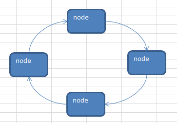

# 数据结构与算法

## 1. 概述

### 1.1 基本概念

数据结构是数据的组织形式

- 数据元素间的逻辑关系，即数据的逻辑结构；
- 数据元素及其关系在计算机存储内的表示，即数据的存储表示；
- 数据的运算，即对数据元素施加的操作。

算法是指操作数据的一组方法

数据结构是为算法服务的，而算法要作用在特定的数据结构上。

程序 = 数据结构 + 算法

数据结构是算法的基础, 换言之，想要学好算法，需要把数据结构学到位。

### 1.2 线性结构与非线性结构

数据结构包括：线性结构和非线性结构。

**线性结构**

线性结构作为最常用的数据结构，其特点是数据元素之间存在一对一的线性关系。

线性结构有两种不同的存储结构，即**顺序存储结构**和**链式存储结构**。

- 顺序存储的线性表称为顺序表，顺序表中的存储元素是连续的。
- 链式存储的线性表称为链表，链表中的存储元素不一定是连续的，元素节点中存放数据元素以及相邻元素的地址信息。

线性结构常见的有：**数组**、**队列**、**链表**和**栈**。

**非线性结构**

非线性结构包括：**二维数组**、**多维数组**、**广义表**、**树结构**、**图结构**。

## 2. 稀疏数组和队列

### 2.1 稀疏数组

#### 2.1.1 基本介绍

> 当一个数组中大部分元素为０，或者为同一个值的数组时，可以使用稀疏数组来保存该数组。

稀疏数组的处理方法是:
记录数组一共有几行几列，有多少个不同的值， 把具有不同值的元素的行列及值记录在一个小规模的数组中，从而缩小程序的规模。

#### 2.2.2 应用实例

**思路分析**

二维数组转稀疏数组

稀疏数组转二维数组

#### 2.2.3 代码实现

```java
public class SparseArray {

    public static void main(String[] args) {
        // 二维数组 => 稀疏数组

        // 1.先创建一个二维数组
        // 11*11 的棋盘 0-没有 1-白子 2-黑子
        int chessboard1[][] = new int[11][11];

        // 赋值
        chessboard1[1][2] = 1;
        chessboard1[2][3] = 2;
        chessboard1[3][4] = 1;

        // 打印棋盘信息
        for (int chess[] : chessboard1) {
            for (int data : chess) {
                System.out.printf("%d\t", data);
            }

            System.out.println();
        }

        // 2.统计二维数组中非 0 元素的个数
        int sum = 0;
        for (int i = 0; i < chessboard1.length; i++) {
            for (int j = 0; j < chessboard1[i].length; j++) {
                if (chessboard1[i][j] != 0) {
                    sum++;
                }
            }
        }
        System.out.println("二维数组中非0元素个数：" + sum);

        // 3.创建一个稀疏数组
        int sparseArray[][] = new int[sum + 1][3];

        // 4.给二维数组的第一行赋值
        sparseArray[0][0] = chessboard1.length;
        sparseArray[0][1] = chessboard1[0].length;
        sparseArray[0][2] = sum;

        // 5.遍历二维数组转成稀疏数组
        int count = 0;
        for (int i = 0; i < chessboard1.length; i++) {
            for (int j = 0; j < chessboard1[i].length; j++) {
                if (chessboard1[i][j] != 0) {
                    count++;
                    sparseArray[count][0] = i;
                    sparseArray[count][1] = j;
                    sparseArray[count][2] = chessboard1[i][j];
                }
            }
        }

        // 遍历输出稀疏数组
        System.out.println("二维数组转化为稀疏数组为：");
        for (int i = 0; i < sparseArray.length; i++) {
            System.out.printf("%d\t%d\t%d\n", sparseArray[i][0], sparseArray[i][1], sparseArray[i][2]);
        }

        // 稀疏数组 => 二维数组
        // 1.创建一个二维数组
        int chessboard2[][] = new int[sparseArray[0][0]][sparseArray[0][1]];

        // 2.遍历稀疏数组转为二维数组
        for (int i = 1; i < sparseArray.length; i++) {
            chessboard2[sparseArray[i][0]][sparseArray[i][1]] = sparseArray[i][2];
        }

        // 遍历输出二维数组
        System.out.println("稀疏数组转二维数组为：");
        for (int chess[] : chessboard2) {
            for (int data : chess) {
                System.out.printf("%d\t", data);
            }
            System.out.println();
        }
    }
}
```

### 2.3 队列

#### 2.3.1 基本介绍

- 队列是一个有序列表，可以用**数组**或**链表**来实现
- 遵循先入先出的原则，即：先存入队列的数据，先取出，后存入的数据后取出

#### 2.3.2 数组模拟队列

思路分析：

1. 队列本身是有序列表，若使用数组的结构来存储队列的数据，则队列数组的声明如下图, 其中 `maxSize` 是该队列的最大容量。
2. 因为队列的输出、输入是分别从前后端来处理，因此需要两个变量 `front` 及 `rear` 分别记录队列前后端的下标。`front` 会随着数据输出而改变，而 `rear` 则是随着数据输入而改变，如图所示:


将数据存入队列时称为**入队**，**入队**的处理需要有两个步骤：
1. 判断队列是否为满：当 `rear = maxSize - 1` 时队列已满
2. 若尾指针 `rear` 小于队列的最大下标 `maxSize - 1`，则将数据存入 `rear` 所指的数组元素中，并将尾指针往后移：`rear + 1`

将数据从队列取出时称为**出队**，**出队**的处理需要有两个步骤：
1. 判断队列是否为空：当 `front = rear` 时队列为空
2. 若 `front != rear`，则将数组元素中下标位置为 `front + 1` 的数据取出，并将头指针往后移：`front + 1`

代码实现：

```java
public class ArrayQueueDemo {

    public static void main(String[] args) {
        // 创建一个队列
        ArrayQueue arrayQueue = new ArrayQueue(3);

        char key = ' ';
        Scanner scanner = new Scanner(System.in);
        boolean loop = true;
        while (loop) {
            System.out.println("s(show)：显示队列");
            System.out.println("e(exit)：推出程序");
            System.out.println("a(add)：数据入队");
            System.out.println("g(get)：数据出队");
            System.out.println("h(head)：查看队头");

            key = scanner.next().charAt(0);

            switch (key) {
                case 's':
                    arrayQueue.showQueue();
                    break;
                case 'e':
                    scanner.close();
                    loop = false;
                    break;
                case 'a':
                    System.out.println("请输入一个值");
                    int value = scanner.nextInt();
                    arrayQueue.addQueue(value);
                    break;
                case 'g':
                    try {
                        int headValue = arrayQueue.getQueue();
                        System.out.printf("取出的数据:%d\n", headValue);
                    } catch (Exception e) {
//                        e.printStackTrace();
                        System.out.println(e.getMessage());
                    }
                    break;
                case 'h':
                    try {
                        int head = arrayQueue.peekQueue();
                        System.out.printf("队头:%d\n", head);
                    } catch (Exception e) {
                        System.out.println(e.getMessage());
                    }
                    break;

                default:
                    break;
            }
        }

        System.out.println("程序退出~");

    }
}

class ArrayQueue {

    /**
     * 表示数组的最大容量
     */
    private int maxSize;

    /**
     * 队头
     */
    private int front;

    /**
     * 队尾
     */
    private int rear;

    /**
     * 存放数据，模拟队列
     */
    private int[] array;

    /**
     * 构造器
     *
     * @param maxSize
     */
    public ArrayQueue(int maxSize) {
        this.maxSize = maxSize;
        array = new int[maxSize];
        front = -1;
        rear = -1;
    }

    /**
     * 判断队列是否为满
     *
     * @return
     */
    public boolean isFull() {
        return this.rear == this.maxSize - 1;
    }

    /**
     * 判断队列是否为空
     *
     * @return
     */
    public boolean isEmpty() {
        return this.rear == this.front;
    }

    /**
     * 数据入队
     *
     * @param data
     */
    public void addQueue(int data) {
        // 判断队列是否满
        if (this.isFull()) {
            System.out.println("队列已满");
            return;
        }

        // rear 后移
        this.rear++;
        this.array[rear] = data;
    }

    /**
     * 数据出队
     *
     * @return
     */
    public int getQueue() {
        // 判断队列是否为空
        if (this.isEmpty()) {
            throw new RuntimeException("队列为空,不能取数据");
        }

        this.front++;
        return this.array[front];
    }

    /**
     * 显示所有的队列数据
     */
    public void showQueue() {
        if (this.isEmpty()) {
            System.out.println("队列为空");
            return;
        }

        for (int i = 0; i < this.array.length; i++) {
            System.out.printf("array[%d]=%d\n", i, array[i]);
        }
    }

    /**
     * 获取队列的头数据，但是不出队
     *
     * @return
     */
    public int peekQueue() {
        if (this.isEmpty()) {
            throw new RuntimeException("队列为空,不能取数据");
        }

        return this.array[front + 1];
    }
}
```

存在的问题和优化：
1. 目前数组只能使用一次就不能使用，没有达到复用的效果
2. 可以使用 % 运算改造成一个**环形队列**

#### 2.3.3 数组模拟环形队列

对前面的数组模拟队列的优化，可以通过取模的方式将数组看做是一个环形的。

分析说明：
1. `front`: 指向队列的第一个元素，初始值为 0
2. `rear`: 指向队列的最后一个元素的后一个位置，初始值为 0
3. 队满：`(rear + 1) % maxSize == front`
4. 队空：`front == rear`
5. 队列中有效数据的个数：`(rear + maxSize - front) % maxSize`

代码实现：
```java
public class CircleArrayQueueDemo {

    public static void main(String[] args) {
        // 创建一个队列
        CircleArrayQueue circleArrayQueue = new CircleArrayQueue(3);

        char key = ' ';
        Scanner scanner = new Scanner(System.in);
        boolean loop = true;
        while (loop) {
            System.out.println("s(show)：显示队列");
            System.out.println("e(exit)：推出程序");
            System.out.println("a(add)：数据入队");
            System.out.println("g(get)：数据出队");
            System.out.println("h(head)：查看队头");

            key = scanner.next().charAt(0);

            switch (key) {
                case 's':
                    circleArrayQueue.showQueue();
                    break;
                case 'e':
                    scanner.close();
                    loop = false;
                    break;
                case 'a':
                    System.out.println("请输入一个值");
                    int value = scanner.nextInt();
                    circleArrayQueue.addQueue(value);
                    break;
                case 'g':
                    try {
                        int headValue = circleArrayQueue.getQueue();
                        System.out.printf("取出的数据:%d\n", headValue);
                    } catch (Exception e) {
//                        e.printStackTrace();
                        System.out.println(e.getMessage());
                    }
                    break;
                case 'h':
                    try {
                        int head = circleArrayQueue.peekQueue();
                        System.out.printf("队头:%d\n", head);
                    } catch (Exception e) {
                        System.out.println(e.getMessage());
                    }
                    break;

                default:
                    break;
            }
        }

        System.out.println("程序退出~");

    }

}

class CircleArrayQueue {

    /**
     * 表示数组的最大容量
     */
    private int maxSize;

    /**
     * 队头
     */
    private int front;

    /**
     * 队尾
     */
    private int rear;

    /**
     * 存放数据，模拟队列
     */
    private int array[];

    /**
     * 构造器
     *
     * @param maxSize
     */
    public CircleArrayQueue(int maxSize) {
        this.maxSize = maxSize;
        this.array = new int[this.maxSize];
    }

    /**
     * 判断队列是否为满
     *
     * @return
     */
    public boolean isFull() {
        return (this.rear + 1) % this.maxSize == this.front;
    }

    /**
     * 判断队列是否为空
     *
     * @return
     */
    public boolean isEmpty() {
        return this.front == this.rear;
    }

    /**
     * 数据入队
     *
     * @param data
     */
    public void addQueue(int data) {
        if (this.isFull()) {
            System.out.println("队列已满");
            return;
        }

        this.array[this.rear] = data;
        this.rear = (this.rear + 1) % this.maxSize;
    }

    /**
     * 数据出队
     *
     * @return
     */
    public int getQueue() {
        // 判断队列是否为空
        if (this.isEmpty()) {
            throw new RuntimeException("队列为空,不能取数据");
        }

        int value = this.array[this.front];
        this.front = (this.front + 1) % this.maxSize;
        return value;
    }

    /**
     * 显示所有的队列数据
     */
    public void showQueue() {
        if (this.isEmpty()) {
            System.out.println("队列为空");
            return;
        }

        // 从 front 开始遍历，遍历多少个元素
        for (int i = this.front; i < this.front + this.size(); i++) {
            System.out.printf("array[%d]=%d\n", i % this.maxSize, array[i % this.maxSize]);
        }
    }

    /**
     * 获取当前队列有效数字的个数
     */
    public int size() {
        return (this.rear + this.maxSize - this.front) % this.maxSize;
    }

    public int peekQueue() {
        if (this.isEmpty()) {
            throw new RuntimeException("队列为空,不能取数据");
        }

        return this.array[front];
    }
}
```

## 3.链表

### 3.1 基本介绍

链表是有序的列表，但是它在内存中是存储如下：


- 链表是以节点的方式来存储,是链式存储
- 每个节点包含 `data` 域保存数据，`next` 域指向下一个节点
- 链表的各个节点不一定是连续存储
- 链表分带头节点的链表和没有头节点的链表

### 3.2 单链表

单链表(带头结点) **逻辑结构**示意图如下：


#### 3.2.1 基本操作

实现对单链表的新增、修改、删除操作。

代码实现：
```java
public class SingleLinkedListDemo {

    public static void main(String[] args) {
        SingleLinkedList singleLinkedList = new SingleLinkedList();
        singleLinkedList.add(new HeroNode(1, "宋江", "及时雨"));
        singleLinkedList.add(new HeroNode(2, "卢俊义", "玉麒麟"));
        singleLinkedList.add(new HeroNode(7, "秦明", "霹雳火"));

        System.out.println("按顺序添加节点");
        singleLinkedList.addByOrder(new HeroNode(1, "宋江", "及时雨"));
        singleLinkedList.addByOrder(new HeroNode(6, "林冲", "豹子头"));
        singleLinkedList.show();

        System.out.println("修改节点");
        // 修改节点
        singleLinkedList.update(new HeroNode(6, "公孙胜", "入云龙"));
        singleLinkedList.show();

        // 删除节点
        System.out.println("删除节点");
        singleLinkedList.delete(2);
        singleLinkedList.show();

        singleLinkedList.delete(6);
        singleLinkedList.show();

        singleLinkedList.delete(60);
    }
}

class HeroNode {
    public int no;

    public String name;

    public String nickName;

    /**
     * 指向下一个节点
     */
    public HeroNode next;

    public HeroNode(int no, String name, String nickName) {
        this.no = no;
        this.name = name;
        this.nickName = nickName;
    }

    @Override
    public String toString() {
        return "HeroNode{" +
                "no=" + no +
                ", name='" + name + '\'' +
                ", nickName='" + nickName + '\'' +
//                ", next=" + next +
                '}';
    }
}

class SingleLinkedList {

    /**
     * 定义一个头节点
     */
    private HeroNode head = new HeroNode(0, "", "");

    /**
     * 在链表的末尾添加节点
     *
     * @param heroNode
     */
    public void add(HeroNode heroNode) {
        // 找到链表的最后一个节点
        HeroNode tempNode = head;
        while (true) {
            if (tempNode.next == null) {
                break;
            }

            // 如果没有找到最后一个节点，将 tempNode 后移
            tempNode = tempNode.next;
        }

        // 将最后一个节点的 next 指向新节点
        tempNode.next = heroNode;
    }

    /**
     * 将节点添加到指定节点
     *
     * @param heroNode
     */
    public void addByOrder(HeroNode heroNode) {

        HeroNode tempNode = head;
        // 标识编号是否存在
        boolean flag = false;

        while (true) {
            if (tempNode.next == null) {
                break;
            }

            if (tempNode.next.no > heroNode.no) {
                // 位置找到了，就在 tempNode 的后面插入
                break;
            } else if (tempNode.next.no == heroNode.no) {
                // 编号已存在
                flag = true;
                break;
            }

            tempNode = tempNode.next;
        }

        if (!flag) {
            heroNode.next = tempNode.next;
            tempNode.next = heroNode;
        } else {
            System.out.printf("要插入的英雄编码 %d 已存在，不能加入了\n", heroNode.no);
        }
    }

    /**
     * 根据节点编号来修改
     *
     * @param heroNode
     */
    public void update(HeroNode heroNode) {
        // 判断是否为空
        if (head.next == null) {
            System.out.println("当前链表为空");
            return;
        }

        // 找到要修改的节点
        HeroNode tempNode = head.next;
        boolean flag = false;

        while (true) {
            if (tempNode.next == null) {
                break;
            }

            if (tempNode.no == heroNode.no) {
                flag = true;
                break;
            }

            tempNode = tempNode.next;
        }

        if (flag) {
            tempNode.name = heroNode.name;
            tempNode.nickName = heroNode.nickName;
        } else {
            System.out.println("没有找到要修改的节点");
        }
    }

    /**
     * 删除节点
     * @param no
     */
    public void delete(int no) {
        // 0.判断链表是否为空
        if (head.next == null) {
            System.out.println("当前链表为空");
            return;
        }

        // 1.找到要删除节点的前一个节点
        HeroNode tempNode = head.next;
        boolean flag = false;

        while (true) {
            if (tempNode.next == null) {
                break;
            }

            if (tempNode.next.no == no) {
                flag = true;
                break;
            }

            tempNode = tempNode.next;
        }

        if (flag) {
            tempNode.next = tempNode.next.next;
        } else {
            System.out.println("没有找到要删除的节点");
        }
    }

    /**
     * 打印链表
     */
    public void show() {
        if (head.next == null) {
            return;
        }

        HeroNode tempNode = head.next;

        while (true) {
            if (tempNode == null) {
                break;
            }

            System.out.println(tempNode);
            tempNode = tempNode.next;
        }
    }
}
```

#### 3.2.2 面试题

获取单链表中的有效节点个数
```java
public int getLength(HeroNode head) {
    if (head.next == null) {
        return 0;
    }

    HeroNode currentNode = head.next;
    int length = 0;
    while (currentNode != null) {
        length++;
        currentNode = currentNode.next;
    }

    return length;
}
```

获取单链表中倒数第k个节点
```java
public HeroNode getKNode(HeroNode head, int k) {
    // 0.判断链表是否为空
    if (head.next == null) {
        return null;
    }

    // 1.先遍历获取单链表的有效个数 length
    int length = getLength(head);

    // 2.校验 k 是否正确
    if (k <= 0 || k > length) {
        return null;
    }

    // 3.从链表的第一个节点开始遍历 length - k 个即可得到
    HeroNode currentNode = head.next;
    for (int i = 0; i < length - k; i++) {
        currentNode = currentNode.next;
    }

    return currentNode;
}
```

单链表反转
```java
public void reverse(HeroNode head) {
    // 0.判断链表是否为空
    if (head.next == null || head.next.next == null) {
        return;
    }

    // 1.定义一个新的头节点
    HeroNode newHead = new HeroNode(-1, null, null);

    // 2.遍历原链表
    HeroNode currentNode = head.next;
    HeroNode nextNode = null;

    while (currentNode != null) {
        // 1.3使用一个临时变量保存当前节点的下一个节点
        nextNode = currentNode.next;
        // 1.2当前节点的下一个节点执行头节点的下一个节点
        currentNode.next = newHead.next;
        // 1.1头节点的下一个节点指向当前节点
        newHead.next = currentNode;
        // 1.4当前节点等于下一个节点
        currentNode = nextNode;
    }

    head.next = newHead.next;
}
```

从尾到头逆序打印单链表
```java
public void reverseShow(HeroNode head) {
    if (head.next == null) {
        return;
    }

    Stack<HeroNode> stack = new Stack<>();
    HeroNode currentNode = head.next;
    while (currentNode != null) {
        stack.push(currentNode);
        currentNode = currentNode.next;
    }

    while (stack.size() > 0) {
        System.out.println(stack.pop());
    }
}
```

合并连个有序的单链表，并且保持有序
```java
public HeroNode merge(HeroNode head1, HeroNode head2) {
    HeroNode newHead = new HeroNode(0, "", "");

    HeroNode currentNode1 = head1.next;
    HeroNode currentNode2 = head2.next;
    HeroNode tempNode = newHead;

    while (currentNode1 != null && currentNode1 != null) {
        if (currentNode1.no < currentNode2.no) {
            tempNode.next = currentNode1;
            // 如果 currentNode1 < currentNode2, currentNode1 就往后移
            currentNode1 = currentNode1.next;
            tempNode = tempNode.next;
        } else if (currentNode1.no == currentNode2.no) {
            tempNode.next = currentNode1;
            // 如果 currentNode1 == currentNode2, currentNode1、currentNode2 就往后移
            currentNode1 = currentNode1.next;
            currentNode2 = currentNode2.next;
            tempNode = tempNode.next;
        } else {
            // 如果 currentNode1 > currentNode2, currentNode2 就往后移
            tempNode.next = currentNode2;
            currentNode2 = currentNode2.next;
            tempNode = tempNode.next;
        }
    }

    if (currentNode1 == null) {
        tempNode.next = currentNode2;
    }

    if (currentNode2 == null) {
        tempNode.next = currentNode1;
    }

    return newHead;
}
```

### 3.3 双向链表

单向链表的缺点分析： 

- 单向链表查找的方向只能是一个方向；而双向链表可以向前或者向后查找
- 单向链表不能自我删除，需要靠辅助节点 ；而双向链表，则可以自我删除。单向链表删除节点时，总是要先找到待删除节点的前一个节点。

#### 3.2.1 基本操作

实现对双向链表的遍历、新增、修改、删除操作。

代码实现：

```java
public class DoubleLinkedListDemo {

    public static void main(String[] args) {
        DoubleLinkedList doubleLinkedList = new DoubleLinkedList();

        doubleLinkedList.add(new Node(1, "宋江", "及时雨"));
        doubleLinkedList.add(new Node(2, "卢俊义", "玉麒麟"));
        doubleLinkedList.add(new Node(3, "吴用", "智多星"));
        doubleLinkedList.add(new Node(4, "公孙胜", "入云龙"));
        doubleLinkedList.add(new Node(10, "花荣", "小李广"));

        // 遍历双向链表
        System.out.println("遍历双向链表~");
        doubleLinkedList.list();

        // 按顺序添加节点
        System.out.println("按顺序添加节点~");
        doubleLinkedList.addByOrder(new Node(2, "卢俊义", "玉麒麟"));
        doubleLinkedList.addByOrder(new Node(6, "林冲", "豹子头"));
        doubleLinkedList.list();

        // 修改双向链表
        System.out.println("修改双向链表~");
        doubleLinkedList.update(new Node(5, "关胜", "大刀"));
        doubleLinkedList.update(new Node(4, "关胜", "大刀"));
        doubleLinkedList.list();

        // 删除双向链表
        System.out.println("删除双向链表1~");
        doubleLinkedList.delete(5);
        doubleLinkedList.list();
        System.out.println("删除双向链表2~");
        doubleLinkedList.delete(4);
        doubleLinkedList.list();
        System.out.println("删除双向链表3~");
        doubleLinkedList.delete(2);
        doubleLinkedList.list();
    }
}

class Node {
    public int no;

    public String name;

    public String nickName;

    /**
     * 指向前一个节点
     */
    public Node pre;

    /**
     * 指向下一个节点
     */
    public Node next;

    public Node(int no, String name, String nickName) {
        this.no = no;
        this.name = name;
        this.nickName = nickName;
    }

    @Override
    public String toString() {
        return "Node{" +
                "no=" + no +
                ", name='" + name + '\'' +
                ", nickName='" + nickName + '\'' +
                '}';
    }
}

class DoubleLinkedList {

    private Node head = new Node(0, "", "");

    /**
     * 遍历双向链表
     */
    public void list() {
        if (head.next == null) {
            System.out.println("双线链表为空");
            return;
        }

        Node node = head.next;
        while (node != null) {
            System.out.println(node);
            node = node.next;
        }
    }

    /**
     * 在链表末尾添加节点
     *
     * @param newNode
     */
    public void add(Node newNode) {
        Node node = head;

        // 遍历找到最后一个节点
        while (true) {
            if (node.next == null) {
                break;
            }
            node = node.next;
        }

        node.next = newNode;
        newNode.pre = node;
    }

    /**
     * 按照顺序添加节点
     *
     * @param node
     */
    public void addByOrder(Node node) {

        Node tempNode = head;
        boolean flag = false;

        while (true) {
            if (tempNode.next == null) {
                break;
            }
            if (tempNode.no > node.no) {
                break;
            } else if (tempNode.no == node.no) {
                flag = true;
                break;
            }

            tempNode = tempNode.next;
        }

        if (flag) {
            System.out.printf("要插入的英雄编码 %d 已存在，不能加入了\n", node.no);
        } else {
            tempNode.pre.next = node;
            tempNode.pre = node;
            node.next = tempNode;
        }
    }

    /**
     * 修改节点信息
     *
     * @param node
     */
    public void update(Node node) {
        if (head.next == null) {
            System.out.println("双向链表为空");
            return;
        }

        Node tempNode = head.next;
        boolean flag = false;
        while (tempNode != null) {
            if (tempNode.no == node.no) {
                flag = true;
                break;
            }
            tempNode = tempNode.next;
        }

        if (flag) {
            tempNode.name = node.name;
            tempNode.nickName = node.nickName;
        } else {
            System.out.println("没有找到要修改的节点");
        }
    }

    /**
     * 删除节点信息
     *
     * @param no
     */
    public void delete(int no) {
        if (head.next == null) {
            System.out.println("双向链表为空");
            return;
        }

        Node node = head.next;
        boolean flag = false;

        while (node != null) {
            if (node.no == no) {
                flag = true;
                break;
            }

            node = node.next;
        }

        if (flag) {
            // 要删除节点的前一个节点指向要删除节点的下一个节点
            node.pre.next = node.next;
            // 要删除节点的后一个节点指向要删除节点的前一个节点
            // 如果要删除的是最后一个节点呢？
            if (node.next != null) {
                node.next.pre = node.pre;
            }
        } else {
            System.out.println("没有找到要删除的节点信息");
        }
    }
}
```

### 3.4 单向循环链表



### 3.5 约瑟夫环问题

**`Josephu`  问题：**

设编号为1，2，… n 的 n 个人围坐一圈，约定编号为 k（1<=k<=n）的人从 1 开始报数，数到 m 的那个人出列，它的下一位又从 1 开始报数，数到 m 的那个人又出列，依次类推，直到所有人出列为止，由此产生一个出队编号的序列。

**思路分析：**

用一个不带头结点的循环链表来处理 `Josephu` 问题：先构成一个有 n 个结点的单循环链表，然后由 k 结点起从 1 开始计数，计到 m 时，对应结点从链表中删除，然后再从被删除结点的下一个结点又从 1 开始计数，直到最后一个结点从链表中删除算法结束。

代码实现：

```java
public class JosephDemo {

    public static void main(String[] args) {
        SingleCircleLinkedList singleCircleLinkedList = new SingleCircleLinkedList();

        System.out.println("单向循环链表初始化~");
        singleCircleLinkedList.init(5);
        singleCircleLinkedList.list();

        System.out.println("测试初圈");
        singleCircleLinkedList.countBoy(3, 3, 5);
    }
}

class Boy {

    public int no;

    public Boy next;

    public Boy(int no) {
        this.no = no;
    }

}

class SingleCircleLinkedList {

    // 先创建一个 first 节点
    private Boy first;

    /**
     * 初始化环形链表
     *
     * @param numbers 要添加节点的个数
     */
    public void init(int numbers) {
        // 对 numbers 进行数据校验
        if (numbers < 1) {
            System.out.println("numbers 的至少大于1");
            return;
        }

        // 辅助指针
        Boy currentBoy = null;

        for (int i = 1; i <= numbers; i++) {
            Boy boy = new Boy(i);
            if (i == 1) {
                first = boy;
                first.next = first;
                currentBoy = first;
            } else {
                currentBoy.next = boy;
                boy.next = first;
                currentBoy = boy;

            }
        }
    }

    /**
     * 遍历单向环形链表
     */
    public void list() {
        if (first == null) {
            System.out.println("单向环形链表为空~");
            return;
        }

        Boy currentBoy = first;
        while (true) {
            System.out.printf("当前节点编号：%d\n", currentBoy.no);
            if (currentBoy.next == first) {
                break;
            }
            currentBoy = currentBoy.next;
        }
    }

    /**
     * 统计输出小孩出圈
     *
     * @param startNo  从第几个小孩开始数数
     * @param countNum 表示每次数几个
     * @param nums     表示最初圈里有多少个孩子
     */
    public void countBoy(int startNo, int countNum, int nums) {
        // 对数据进行校验
        if (first == null || startNo < 1 || startNo > nums || countNum < 1) {
            System.out.println("参数输入有误");
            return;
        }

        // 使用遍历，找到单向循环链表的最后一个节点
        Boy helperBoy = first;
        while (true) {
            if (helperBoy.next == first) {
                break;
            }
            helperBoy = helperBoy.next;
        }

        // 移动 startNo - 1 次，找到开始数数的那个节点编号
        for (int i = 0; i < startNo - 1; i++) {
            first = first.next;
            helperBoy = helperBoy.next;
        }

        while (true) {
            if (helperBoy == first) {
                break;
            }

            for (int i = 0; i < countNum - 1; i++) {
                first = first.next;
                helperBoy = helperBoy.next;
            }

            // 此时 first 的节点要初圈
            System.out.printf("编号为：%d初圈\n", first.no);

            first = first.next;
            helperBoy.next = first;
        }
        System.out.printf("最后留圈的编号：%d", first.no);
    }
}
```

## 4.栈

### 4.1 基本介绍

- 栈的英文为：**stack**
- 栈是一个**先入后出**( FILO - First In Last Out)的有序列表
- **栈(stack)**是限制线性表，元素的插入和删除只能在线性表的同一端进行
- 允许插入和删除的一端，为变化的一端，称为**栈顶(Top)**，另一端为固定的一端，称为**栈底(Bottom)**
- 根据栈的定义可知，最先放入栈中元素在栈底，最后放入的元素在栈顶，而删除元素刚好相反，最后放入的元素最先删除，最先放入的元素最后删除


**栈的应用场景**

- 子程序的调用：在跳往子程序前，会先将下个指令的地址存到堆栈中，直到子程序执行完后再将地址取出，以回到原来的程序中
- 处理递归调用：和子程序的调用类似，只是除了储存下一个指令的地址外，也将参数、区域变量等数据存入堆栈中
- 表达式的转换[中缀表达式转后缀表达式]与求值
- 二叉树的遍历
- 图形的深度优先(depth一first)搜索法

### 4.2 数组模拟栈


代码实现：

```java
public class ArrayStackDemo {

    public static void main(String[] args) {
        ArrayStack arrayStack = new ArrayStack(4);

        boolean flag = true;
        Scanner scanner = new Scanner(System.in);
        String key = "";

        while (flag) {
            System.out.println("exit:退出程序");
            System.out.println("push:数据入栈");
            System.out.println("pop:数据出栈");
            System.out.println("list:遍历栈");

            key = scanner.next();

            switch (key) {
                case "exit":
                    scanner.close();
                    flag = false;
                    break;
                case "push":
                    int value = scanner.nextInt();
                    arrayStack.push(value);
                    break;
                case "pop":
                    try {
                        int pop = arrayStack.pop();
                        System.out.printf("出栈数据%d\n", pop);
                        break;
                    } catch (Exception e) {
                        e.printStackTrace();
                    }
                case "list":
                    arrayStack.list();
                    break;
                default:
                    break;
            }
        }

        System.out.println("退出程序成功~");
    }
}

class ArrayStack {
    /**
     * 栈的大小
     */
    private int maxSize;

    /**
     * 将数据放在数组中
     */
    private int[] stack;

    /**
     * 栈顶
     */
    private int top = -1;

    public ArrayStack(int maxSize) {
        this.maxSize = maxSize;
        this.stack = new int[maxSize];
    }

    /**
     * 判断栈是否已满
     *
     * @return
     */
    public boolean isFull() {
        return this.top == this.maxSize - 1;
    }

    /**
     * 判断栈是否为空
     *
     * @return
     */
    public boolean isEmpty() {
        return this.top == -1;
    }

    /**
     * 入栈
     *
     * @param value
     */
    public void push(int value) {
        // 判断栈是否已满
        if (isFull()) {
            System.out.println("栈已满~");
            return;
        }
        top++;
        this.stack[top] = value;
    }

    /**
     * 出栈
     *
     * @return
     */
    public int pop() {
        // 先判断栈是否为空
        if (isEmpty()) {
            throw new RuntimeException("栈为空~");
        }

        int value = this.stack[top];
        top--;

        return value;
    }

    /**
     * 遍历栈
     */
    public void list() {
        if (isEmpty()) {
            System.out.println("栈为空~");
            return;
        }
        for (int i = this.top; i >= 0; i--) {
            System.out.printf("stack[%d]=%d\n", i, this.stack[i]);
        }
    }
}
```

### 4.3 链表模拟栈

#### 4.3.1 单向链表模拟栈

代码实现：

```jade
public class LinkedListStackDemo {

    public static void main(String[] args) {
        LinkedListStack linkedListStack = new LinkedListStack(4);

        boolean flag = true;
        Scanner scanner = new Scanner(System.in);
        String key = "";

        while (flag) {
            System.out.println("exit:退出程序");
            System.out.println("push:数据入栈");
            System.out.println("pop:数据出栈");
            System.out.println("list:遍历栈");

            key = scanner.next();

            switch (key) {
                case "exit":
                    scanner.close();
                    flag = false;
                    break;
                case "push":
                    int value = scanner.nextInt();
                    linkedListStack.push(value);
                    break;
                case "pop":
                    try {
                        int pop = linkedListStack.pop();
                        System.out.printf("出栈数据%d\n", pop);
                        break;
                    } catch (Exception e) {
                        e.printStackTrace();
                    }
                case "list":
                    linkedListStack.list();
                    break;
                default:
                    break;
            }
        }

        System.out.println("退出程序成功~");
    }
}

class Node {

    private int data;

    public Node next;

    public Node(int data) {
        this.data = data;
    }

    public int getData() {
        return data;
    }

    public void setData(int data) {
        this.data = data;
    }

    @Override
    public String toString() {
        return "Node{" +
                "data=" + data +
                '}';
    }
}

class SingleLinkedList {
    private Node head = new Node(-1);

    /**
     * 在末尾添加节点
     *
     * @param node
     */
    public void add(Node node) {

        Node nextNode = head;

        while (true) {
            if (nextNode.next == null) {
                break;
            }
            nextNode = nextNode.next;
        }

        nextNode.next = node;
    }

    /**
     * 获取并移除最后一个节点
     *
     * @return
     */
    public Node getAndRemoveLastNode() {
        if (head.next == null) {
            throw new RuntimeException("链表为空~");
        }

        Node nextNode = head;

        while (true) {
            if (nextNode.next.next == null) {
                break;
            }
            nextNode = nextNode.next;
        }

        Node lastNode = nextNode.next;
        nextNode.next = null;

        return lastNode;

    }

    /**
     * 获取倒数第 K 个节点
     *
     * @return
     */
    public Node getKNode(int k) {

        if (head.next == null) {
            throw new RuntimeException("链表为空~");
        }

        int length = getLength();
        if (k < 1 || k > length) {
            throw new IllegalArgumentException("参数k至少要大于等于1且要小于等于链表的有效节点个数~");
        }

        Node tempNode = head;

        for (int i = 0; i < k; i++) {
            tempNode = tempNode.next;
        }

        return tempNode;
    }

    /**
     * 获取链表有效节点的个数
     *
     * @return
     */
    public int getLength() {
        if (head.next == null) {
            return 0;
        }

        int sum = 0;

        Node tempNode = head.next;
        while (tempNode != null) {
            sum++;
            tempNode = tempNode.next;
        }

        return sum;
    }
}

class LinkedListStack {

    private int maxSize;

    private SingleLinkedList stack = new SingleLinkedList();

    private int top = -1;

    public LinkedListStack(int maxSize) {
        this.maxSize = maxSize;
    }

    /**
     * 判断栈是否已满
     *
     * @return
     */
    public boolean isFull() {
        return this.top == this.maxSize - 1;
    }

    /**
     * 判断栈是否为空
     *
     * @return
     */
    public boolean isEmpty() {
        return this.top == -1;
    }

    /**
     * 入栈
     *
     * @param value
     */
    public void push(int value) {
        if (isFull()) {
            System.out.println("栈已满~");
            return;
        }

        this.top++;
        this.stack.add(new Node(value));
    }

    /**
     * 出栈
     *
     * @return
     */
    public int pop() {
        if (isEmpty()) {
            throw new RuntimeException("栈为空~");
        }

        this.top--;
        return this.stack.getAndRemoveLastNode().getData();
    }

    /**
     * 遍历打印栈
     */
    public void list() {
        if (isEmpty()) {
            System.out.println("栈为空~");
            return;
        }

        for (int i = this.top; i >= 0; i--) {
            System.out.printf("stack[%d]=%d\n", i, this.stack.getKNode(i + 1).getData());
        }
    }
}
```

